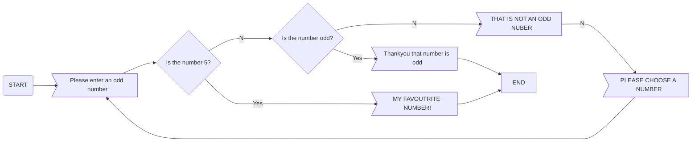

# SIMPLE FLOWCHART

Ask the user for an odd number

If the number is even, respond “THAT IS NOT  AN ODD NUMBER” and ask again

If the number is 5, respond “MY FAVOURITE NUMBER!”

If the number is odd respond with “THANKYOU THAT NUMBER IS ODD”



```

```